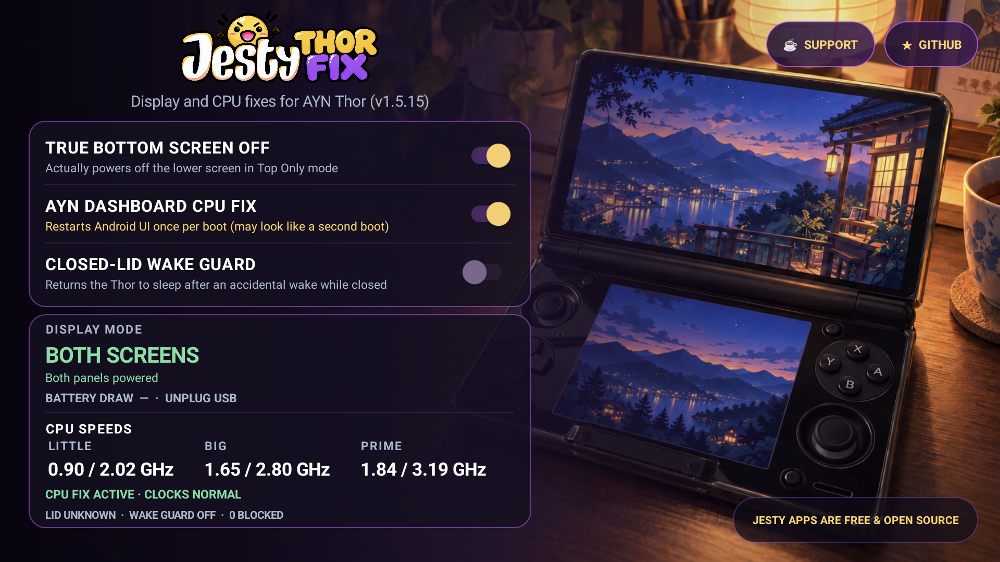

  

  <strong>Real hardware fixes for the AYN Thor.</strong> 
  Lower-screen power-off · Normal CPU idle behaviour · Closed-lid wake protection

  <a href="https://github.com/JestyLabs/Jesty-Thor-Fix/releases/tag/v1.6.0"><strong>Download v1.6.0</strong></a>
  · <a href="#what-it-fixes">Features</a>
  · <a href="#measured-on-a-real-thor">Results</a>
  · <a href="#current-investigations">Research</a>
  · <a href="https://www.buymeacoffee.com/jesty">☕ Support</a>

  
  
  

  Signed releases · Tested on a physical Thor · Fixes keep working after you close the app

  

---

### What it fixes

| Control | What it does |
|---------|--------------|
| **True Bottom Screen Off** | Powers down the lower physical display in TOP mode instead of leaving it active behind a black image. Repairs the state after sleep/wake. |
| **AYN Dashboard CPU Fix** | Stops the Dashboard from keeping the main CPU clusters stuck near their top speeds under light load. Does **not** force CPU frequencies or change governors. |
| **Closed-Lid Wake Guard** | Puts the Thor back to sleep if it wakes while the lid is still closed. Optional and **off by default**. |

Open the dashboard to see the lower screen's real hardware state, CPU speeds, estimated system power and Wake Guard status.

  

  The app dashboard running on a real AYN Thor.

---

### Measured on a real Thor

Short controlled A/B/A test in TOP mode, same device/setup/workload:

| Metric | Native TOP | True Bottom Off |
|--------|------------:|----------------:|
| Efficiency CPU cluster avg. | 2.016 GHz | 1.616 GHz |
| Performance CPU cluster avg. | 2.707 GHz | 1.654 GHz |
| Performance CPU samples near max | 75/75 | 0/45 |
| System power proxy | ~2.03 W | ~1.24 W |

The power number is a **system-level proxy**, not a panel-only measurement and not a battery-life promise. In this test, true-off also let the CPU scale down normally, so the reduction is the combined system effect. Android/Qualcomm commonly call these CPU groups LITTLE and BIG; the technical docs keep those names.

<strong>Technical proof in one minute</strong>

- DRM/CRTC state confirms whether each physical display pipeline is active.
- In stock TOP mode the lower CRTC remained active; with True Bottom Screen Off it became inactive.
- The Thor's Qualcomm display stack also exposed a separate low-load CPU performance-hint problem when both display paths were active.
- Controlled A/B/A captures are published with raw CSV samples.

See [benchmarks](docs/BENCHMARKS.md), [architecture](docs/ARCHITECTURE.md) and [live results](docs/LIVE-RESULTS.md).

Full method + raw CSVs → [benchmarks](docs/BENCHMARKS.md)

---

### Current investigations

We're also exploring a few improvements. **These are still being researched, not included as fixes in v1.6.0.**

- **🖥️ 120 Hz / screen tearing** — Investigating display issues when the two screens use different refresh rates.
- **⚡ Background efficiency** — Finding ways to reduce background work without making screen fixes slower.
- **🔌 Device-service reliability** — Investigating a case where a built-in Thor service became unavailable.
- **🎮 TOP-mode focus** — Checking whether games can lose focus when only the upper screen is in use.

---

### How to use

1. [Download the latest signed APK](https://github.com/JestyLabs/Jesty-Thor-Fix/releases/tag/v1.6.0)
2. Install and open **Jesty Thor Fix**
3. Enable the controls you want
4. Close the app (or swipe it away). The fixes continue in the background.

The app uses the Thor’s own privileged bridge. No Magisk or root required.

> **Note:** Changing the CPU Fix restarts Android UI/display once and closes open apps. The Thor's Qualcomm display stack caches this vendor setting when the composer starts, so a running-system change cannot be applied safely without replacing that composer. On stock Thor firmware, no safe app-controlled path was found that can set the property before the first composer starts. v1.6.0 therefore moves the required boot-time recovery into the natural startup window instead of letting it happen later; a slightly longer black startup phase is normal. Removing that restart entirely would require new vendor/firmware/init support or equivalent earlier privileged execution.

---

### Safety

- Does **not** write CPU frequencies, voltages, thermal limits, or firmware
- Validates the result after every change
- Automatically restores normal behaviour if something looks wrong
- Closed-Lid Wake Guard is off by default
- No gameplay micro-stutter or thermal regression has been demonstrated from the background watcher. Its real idle cost is being measured before any polling change is considered.

More details on resource use and known limitations are in the documentation below.

---

### Compatibility

| Device | Status |
|--------|--------|
| **AYN Thor** | Supported (tested on Android 13 firmware `TKQ1.231222.001`) |
| **Retroid Pocket Duo** | Research / testers wanted — not supported yet |
| Other devices | Unsupported |

Power savings depend on usage, brightness, firmware and workload. **No fixed battery-life percentage is claimed.**

---

### Roadmap

Beyond the investigations above, the next priorities are:

- **Retroid Pocket Duo feasibility** — research and volunteer hardware testing, feature by feature. **Not supported yet.**
- **More edge-case coverage** — BOTTOM-only/dock behaviour, external-display and lid transitions, updater testing, and clearer hardware profiles.

Changes only move into a release after the required hardware validation. See the [full roadmap](docs/ROADMAP.md).

---

### Support the project

Jesty Thor Fix is free and open source. No features are locked behind donations.

  

- ⭐ Star the repository so other Thor owners can find it
- 🧪 Share results from another firmware
- 🐛 Report reproducible issues
- 💬 Join the original [Reddit discussion](https://www.reddit.com/r/AynThor/comments/1wrsmmo/found_two_weird_ayn_thor_issues_top_only_doesnt/)

---

### Documentation

[Architecture](docs/ARCHITECTURE.md) · 
[Compatibility](docs/COMPATIBILITY.md) · 
[Benchmarks](docs/BENCHMARKS.md) · 
[Release notes](docs/RELEASE-NOTES-1.6.0.md) · 
[Build from source](docs/BUILD-AND-RELEASE.md) · 
[Release integrity](docs/RELEASE-INTEGRITY.md)

<strong>Technical implementation</strong>

Jesty Thor Fix follows the physical TOP/BOTH switch. It waits for Android and both displays to settle, then verifies the hardware state (CRTC).

The CPU Fix only sets the vendor property `vendor.display.disable_system_load_check`.  
Enabling it triggers one compositor restart.

Closed-Lid Wake Guard sends `KEYCODE_SLEEP` only after confirming the lid is still closed.

See [Architecture](docs/ARCHITECTURE.md) for the full service, daemon, verification and boot behaviour.

<strong>License, provenance & independence</strong>

- Source & build scripts: [GPL-3.0](LICENSE)
- Branding & artwork: [ASSETS-LICENSE.md](ASSETS-LICENSE.md)
- Third-party notices: [THIRD_PARTY_NOTICES.md](THIRD_PARTY_NOTICES.md)
- Project provenance & attribution: [NOTICE](NOTICE.md) · [research ledger](PROVENANCE.md)
- AI assistance: [full disclosure](AI_DISCLOSURE.md)

Independent community project. Not affiliated with or endorsed by AYN.  
Hardware claims are based on physical device evidence.

