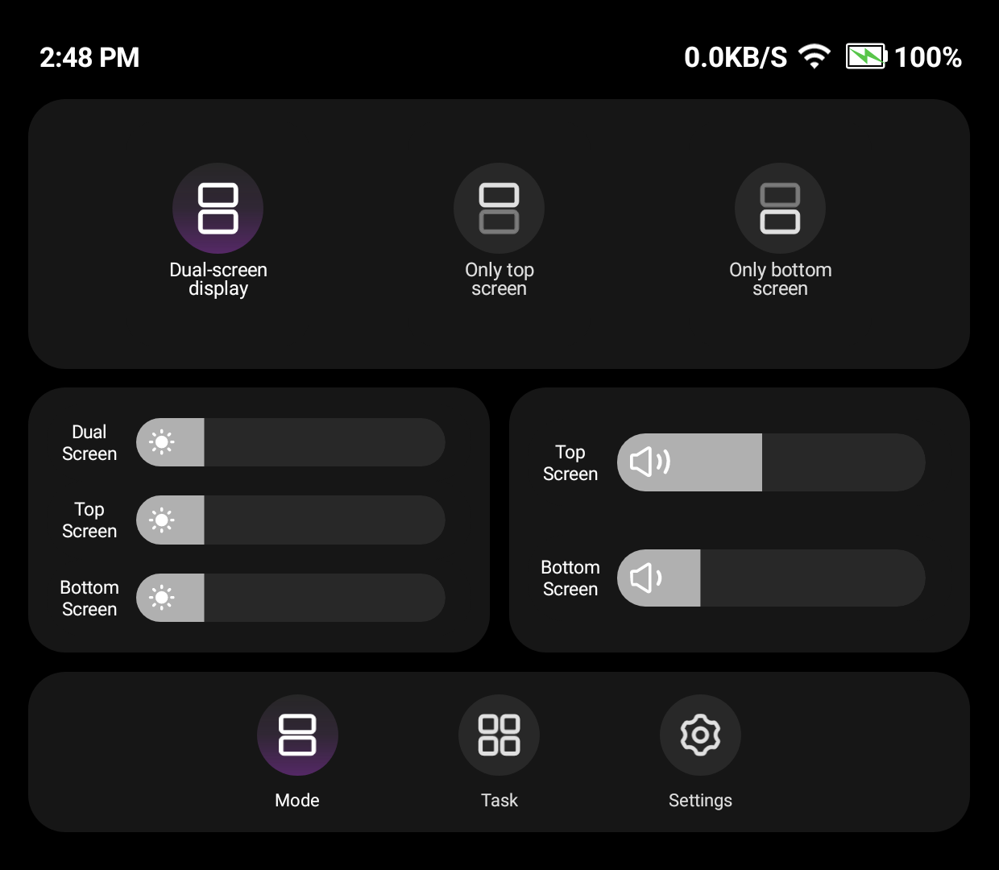
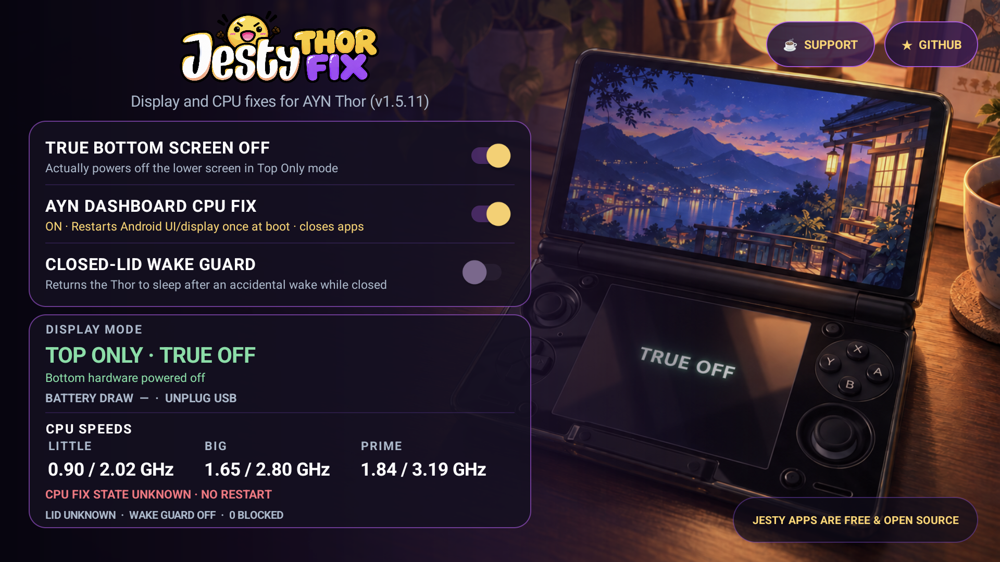
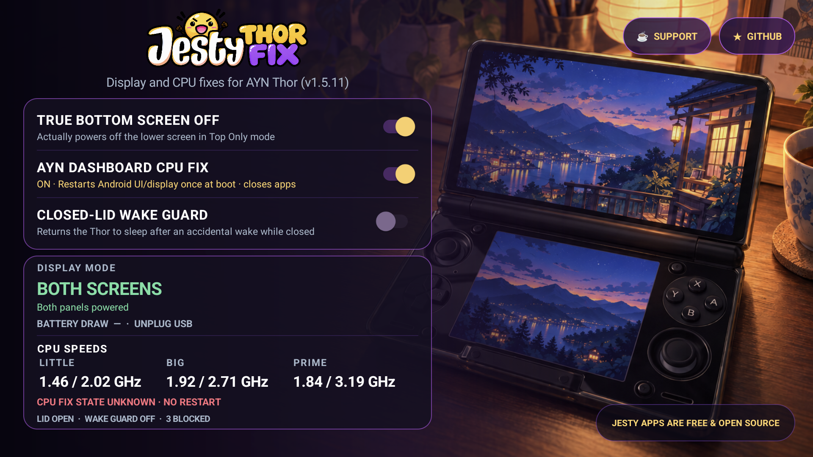
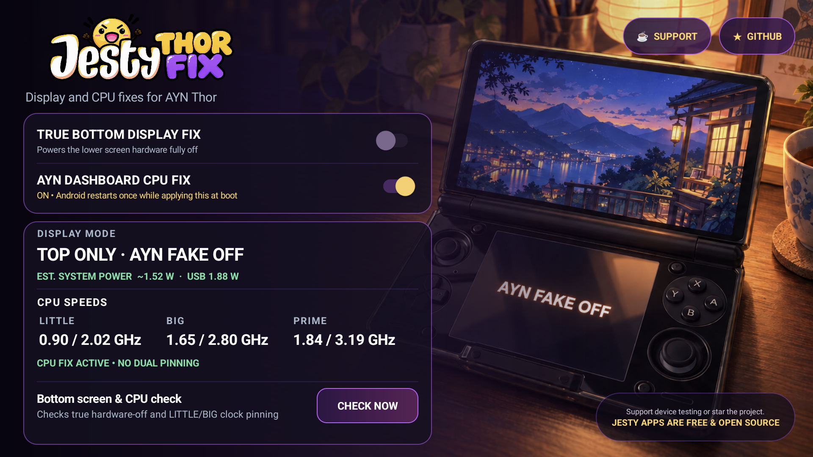
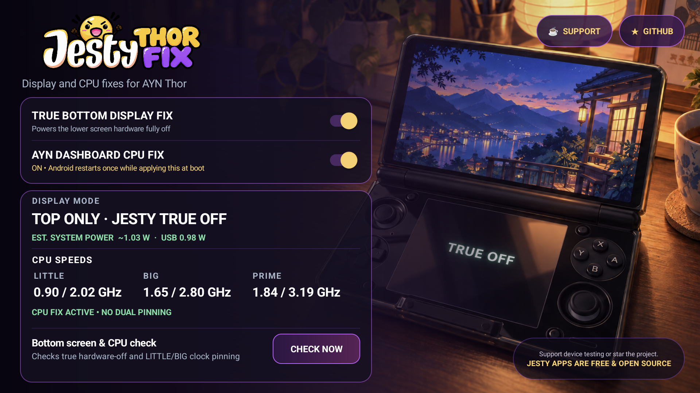
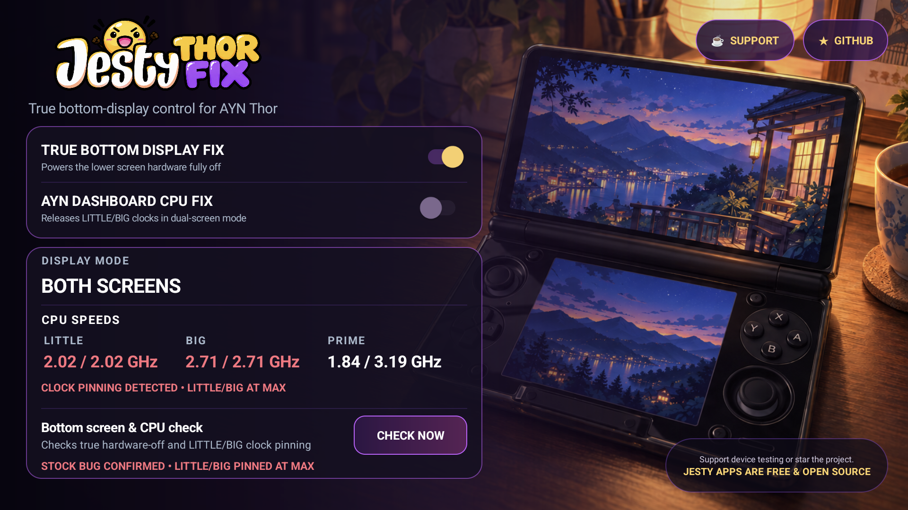

<p align="center">
  
</p>

<p align="center">
  <strong>Fixes two separate AYN Thor firmware problems.</strong><br>
  A lower screen that looks off but is still active, and CPU clocks that can
  stay pinned while using AYN Dashboard.
</p>

<p align="center">
  <strong>No Magisk. No terminal. No need to keep the app open.</strong><br>
  Install it, enable the fixes you need, and forget about it.
</p>

> **Latest stable release:** [v1.5.16](https://github.com/JestyLabs/Jesty-Thor-Fix/releases/tag/v1.5.16)
> keeps the v1.5.15 BOTH/TOP, Wake Guard and CPU Fix behavior and removes the
> observed stale-socket boot delay. The exact signed APK passed host checks,
> an in-place installation and **one supervised cold boot** on the maintainer's
> Thor: `BOOT READY` at 65.479 s, both CRTCs active in BOTH, one Android UI
> restart, and no reported green flash or artifact. This is one observation,
> not a boot-time guarantee. BOTTOM ONLY and physical dock use remain deferred.

<p align="center">
  <a href="https://github.com/JestyLabs/Jesty-Thor-Fix/releases/tag/v1.5.16"><strong>Download latest APK</strong></a>
  · <a href="#what-does-it-fix">What it fixes</a>
  · <a href="#whats-in-v1516">What's new</a>
  · <a href="#power-and-possible-battery-benefit">Measurements</a>
  · <a href="https://www.buymeacoffee.com/jesty">☕ Support development</a>
</p>

## What's in v1.5.16

The daemon now recognizes a private socket left by an earlier kernel boot
and starts without the former 30-second pathname wait. An unreadable or
unstamped boot ID keeps a bounded five-second grace. The boot trace includes
receiver, service, daemon, gate and compositor timing. The compositor helper
checks the old daemon's identity before signalling it and waits for its exit.
The safety grace periods are unchanged. In the supervised v1.5.16 BOTH cold
boot, READY arrived at 65.479 seconds; see the [validation diary](docs/VALIDATION-1.5.16-PENDING.md).

## Features introduced by v1.5.15

- **True Bottom Screen Off** follows the physical AYN TOP/BOTH selection and
  restores true hardware off after a TOP sleep/wake.
- **AYN Dashboard CPU Fix** restores a saved ON setting after a cold boot,
  verifies that the vendor property became active, and lets LITTLE/BIG clocks
  fall below their maxima in the observed AYN Dashboard session.
- **Closed-Lid Wake Guard** is a third, optional switch. It uses the Thor's
  Hall switch to return an accidental closed-lid wake to sleep. It starts OFF
  and pauses after three blocked wakes in ten seconds until the lid opens.
- **Staged boot restoration** waits for Android, the display compositor, AYN
  mode, and both display controllers to settle before changing the display.
  If CPU Fix needs a compositor restart, display actions stay on hold until
  Android returns. An unknown mode never causes a speculative lower-panel ON.

The CPU Fix compositor restart can look like a second boot. On the supervised
v1.5.15 cold boot, the kernel boot ID changed once, Android returned after
one compositor restart, and `BOOT READY` arrived at about 95 seconds. No
green flash or artifact was reported. The boot duration has a separate
[measurement follow-up](docs/VALIDATION-1.5.0-PENDING.md#boot-duration-follow-up-for-independent-analysis).

### Real v1.5.15 screenshots

Jesty Thor Fix on the **upper screen** after that cold boot: BOTH panels
active, CPU Fix confirmed, Wake Guard OFF. The shorter CPU Fix description
fits on one line at the original font size.

<p align="center">
  
</p>

At the same time, **AYN Dashboard was open on the lower screen** in its
dual-screen mode. These are separate captures of the two physical displays
from the same post-boot check.

<p align="center">
  
</p>

These captures show one observed session, not every firmware or boot
configuration. The [validation diary](docs/VALIDATION-1.5.0-PENDING.md)
separates host tests, physical observations, and deferred scenarios.

<details>
<summary><strong>Earlier TOP and Wake Guard test captures</strong></summary>

The following images are from **v1.5.11**, before the v1.5.15 CPU Fix restore.
They document the physical TOP true-off and closed-lid anti-loop checks. Their
CPU status text reflects that older build; they are not v1.5.15 screenshots.

<p align="center">
  
</p>
<p align="center">
  
</p>

</details>

<p align="center">
  
  
  
  
</p>

## What does it fix?

The app has **two independent fixes** for two Thor firmware problems, plus
an optional closed-lid wake guard:

| Problem | What you may notice | Fix to enable |
| --- | --- | --- |
| The lower display is black in TOP mode, but its hardware is still active | The screen looks off, yet the display controller remains on and can return after wake | **True Bottom Screen Off** |
| AYN Dashboard can keep LITTLE/BIG CPU clocks pinned high | The CPU cannot downclock normally at low load, potentially wasting power and producing extra heat | **AYN Dashboard CPU Fix** |

Use only the fix you need, or enable both. The choices are saved and restored
after a normal reboot.

The physical AYN button can switch between TOP and BOTH without opening AYN
Dashboard. The app follows that shortcut and reconciles the lower display
after the mode settles.

### Which switches should I use?

| How you use the Thor | Recommended setting |
| --- | --- |
| You use TOP mode and want the lower display truly powered off | Enable **True Bottom Screen Off** |
| You use AYN Dashboard or regularly use both screens | Enable **AYN Dashboard CPU Fix** |
| You switch between TOP and BOTH | Enable **both fixes** |
| You want accidental closed-lid wakes returned to sleep | Optionally enable **Closed-Lid Wake Guard** |

### Closed-Lid Wake Guard

When enabled, the guard reads the Thor's Hall switch. Closing the lid lets the
device sleep; a wake while the lid remains closed is returned to sleep after a
short check. Opening the lid during that wait allows normal wake. To avoid a
sleep/wake loop, the guard pauses after three blocked wakes in ten seconds and
resumes after the lid opens. It is **OFF by default** and only starts after
boot restoration reaches `READY`.

The close/open sequence, one controlled false wake, and the anti-loop pause
passed supervised tests on the physical Thor. External-display dock use was
not physically tested and is deferred. With the guard OFF, `LID UNKNOWN` in
the dashboard means the Hall watcher is inactive; it says nothing about the
CPU Fix.

## Bug 1: black does not always mean off

When you select **TOP** mode, the expected result is simple: the top screen
stays on and the lower display powers down.

On the tested Thor firmware, the stock mode could make the lower panel look
completely black while its physical display hardware was still active. Looking
at the glass is therefore not enough to tell whether it is really off.

**True Bottom Screen Off** follows the selected display mode:

- in **TOP**, it powers down the lower display hardware;
- after sleep or wake, it checks and restores true-off if Android reactivated it;
- in **BOTH**, it keeps both displays available normally;
- it does not choose a display mode for you.

BOTTOM ONLY is outside the validated v1.5.15 scope and is a possible future
improvement.

| | Stock TOP-only | TOP with Jesty true-off |
| --- | --- | --- |
| What the lower panel looks like | Black | Black |
| Physical lower display hardware | **Still active** on the tested firmware | **Powered off** |
| After sleep/wake | Lower hardware can become active again | True-off is restored automatically |
| App must remain open | — | **No** |

| AYN fake-off: black, hardware active | Jesty true-off: hardware powered down |
| --- | --- |
|  |  |

The dashboard verifies the physical display state automatically. `TOP ONLY ·
TRUE OFF` means the lower CRTC is inactive; `TOP ONLY · AYN BLACK SCREEN`
means the panel looks black but its hardware remains active.

## Bug 2: AYN Dashboard can hold CPU clocks at maximum

The Thor CPU has different groups of cores. The app labels them **LITTLE**,
**BIG**, and **PRIME**. “Pinned” means a group remains at or near its maximum
frequency even when the device is under light load.

This second bug is separate from the lower-screen true-off problem. It can
happen while **both screens are intentionally on**.

When LITTLE and BIG stay pinned at maximum, the CPU cannot reduce those clocks
normally during light use. That unnecessary high-frequency state can consume
more power, create more heat, and reduce battery runtime.

We reproduced it with AYN Dashboard genuinely open on the lower display and
the Thor in BOTH mode. Under low load:

- LITTLE remained at **2.02 / 2.02 GHz**;
- BIG remained at **2.71 / 2.71 GHz**;
- the sustained high-clock condition was detected in red by Jesty Thor Fix.

<p align="center">
  
</p>

**AYN Dashboard CPU Fix** disables the vendor display system-load check that
caused the reproduced behavior. It does **not** set CPU frequencies, change
governors, or apply a performance profile.

An earlier focused BOTH-mode validation recorded **0/25 samples** where
LITTLE and BIG were simultaneously stuck at maximum with the fix enabled.

On v1.5.15, the saved CPU Fix also restored after a supervised cold boot on
the tested Thor. Its firmware leaves the vendor property unconfigured during
boot; the app waits for a safe state, applies the saved ON choice once, and
reports the fix active only after reading back the expected value. With AYN
Dashboard open on the lower screen afterward, the upper app showed
`CPU FIX ACTIVE · CLOCKS NORMAL` and LITTLE/BIG below their maxima in the
captured sample.

> [!WARNING]
> Changing **AYN Dashboard CPU Fix** restarts the Android UI/display stack once
> and closes open apps. The displays stay black for a short period while Android
> returns. When enabled, this restart also happens once during a normal boot,
> which can look like a second boot phase. Version 1.2.0 and later prevent the Thor from
> suspending during this transition; the timed protection is released after
> Android has recovered.

## Install once, then close the app

1. Download `Jesty-Thor-Fix-1.5.15.apk` from the
   [latest release](https://github.com/JestyLabs/Jesty-Thor-Fix/releases/tag/v1.5.15).
2. Install and open **Jesty Thor Fix** once.
3. Enable the switch for each problem you want to fix.
4. Leave the dashboard open briefly if you want to see its automatic display
   and CPU diagnosis settle.

The optional Closed-Lid Wake Guard starts OFF. The AYN Dashboard CPU Fix
causes one Android UI/display restart when applying it and once during boot
when restoration needs it.

You do **not** need to root the Thor yourself, install Magisk, use Termux, or
run commands. The app uses the privileged `PServerBinder` bridge already
provided by the Thor firmware.

After setup, you can:

- close the app;
- swipe it away from Recents;
- use another launcher or game;
- switch normally between TOP and BOTH;
- reboot normally and keep your saved choices.

The visible app is only a control panel. A small privileged background service
applies the saved fixes and performs lightweight periodic checks; it does not
run a busy loop.

> [!IMPORTANT]
> **Android Settings → Force stop is different from closing the app.** Force
> stop explicitly blocks the background service until you open the app again.
> Swiping the app away from Recents does not.

## Power and possible battery benefit

Both bugs can waste energy in different ways: Bug 1 can leave unwanted display
hardware active, while Bug 2 can prevent CPU clusters from downclocking
normally. Fixing either behavior may reduce unnecessary power use. Actual
battery life depends on brightness, games, performance mode, temperature,
firmware, and background activity.

Since v1.3.0, the dashboard shows live **Battery draw** only while the Thor is actually
running from its battery. It uses the battery current and voltage reported by
the device, smooths the last five readings, and displays watts. When USB power
is connected the dashboard deliberately shows `UNPLUG USB` instead of mixing
charging input with battery consumption.

The app does not calculate a battery-life gain or convert the live value into
an autonomy estimate. A short historical A/B/A capture of the true-off path is
preserved with its limitations in the [benchmark notes](docs/BENCHMARKS.md).

The separate Dashboard CPU Fix allows LITTLE/BIG to downclock instead of
remaining pinned at maximum, so it can also reduce wasted power. We have not
yet isolated that fix in a controlled wattage or battery-runtime test, so no
percentage is claimed for it.

## Compatibility and coexistence

- Built specifically for the **AYN Thor**.
- Tested on Android 13 firmware `TKQ1.231222.001`, build dated 2026-02-06.
- Requires the Thor firmware's built-in privileged bridge.
- Do not install it on unrelated Android devices.

Jesty Thor Fix does not write CPU governors, clock limits, or tuning profiles.
It is designed not to take ownership of Pulse or Cluster Tune settings, but a
specific combination should only be called confirmed after that exact setup is
tested on-device.

<details>
<summary><strong>What was verified on the physical Thor?</strong></summary>

The exact signed **v1.5.15** APK (versionCode 64) was installed on the
maintainer's Thor. A copy pulled from the device matched the released APK's
SHA-256 byte for byte. The scoped review recorded:

- physical BOTH→TOP→BOTH: the lower CRTC powered off in TOP and both CRTCs
  were active again in BOTH;
- TOP sleep/wake: the lower CRTC returned to true-off without a reported
  green flash;
- Hall close/open, one controlled wake while closed, and the three-attempt
  anti-loop pause; the guard was left OFF;
- one in-place CPU Fix transition and one genuine cold boot of v1.5.15:
  property `1`, one compositor restart, one recovered daemon, and BOTH active;
- AYN Dashboard on the lower display after boot while Jesty on the upper
  showed `CPU FIX ACTIVE · CLOCKS NORMAL` and LITTLE/BIG below their maxima
  in the captured sample;
- private socket, bounded client, distinct-UID and duplicate-daemon cases
  in host and targeted device checks.

The user observed no green flash, artifact, or restart loop. The second visual
Android UI phase did not change the kernel boot ID. The boot reached
`BOOT READY` at about 95 seconds; its duration is a performance follow-up.
This does not replace a full configuration matrix. BOTTOM ONLY and physical
external-display dock use were deferred.

Released APK SHA-256:

```text
093B6AF26E86E072343988C04CBF03256005703D567177E99D308B9BADC71F2B
```

The [validation diary](docs/VALIDATION-1.5.0-PENDING.md) records the
chronology, traces, host tests, and earlier build evidence.

</details>

<details>
<summary><strong>Technical true-off details</strong></summary>

The tested Thor exposes the top and lower displays through DRM CRTCs 181 and
243. Confirmed TOP true-off is `crtc181=1` and `crtc243=0`. During wake,
Android can reactivate the lower display through its shared display-power
pipeline, so the service waits for wake to settle and then performs one final
true-off operation. A generation token cancels stale work during rapid mode or
sleep changes. See [Architecture](docs/ARCHITECTURE.md).

</details>

<details>
<summary><strong>Build from source</strong></summary>

Required tools: PowerShell 5.1/7, JDK 17, Android SDK platform 34, Android Build
Tools 35.0.0, and apktool 3.0.3 or compatible.

Place `apktool.jar` at `tools/apktool.jar`, or set `APKTOOL_JAR`, then run:

```powershell
.\build.ps1
```

The repository contains no signing key or password. Self-built APKs will not
update the official build unless signed with the same private key.

Maintainer checklist: [build and release guide](docs/BUILD-AND-RELEASE.md).

</details>

## Support and documentation

Jesty Thor Fix is free and open source. No feature is locked behind donations.

- ⭐ Star the repository so other Thor owners can find it.
- 🧪 Share carefully redacted results from another firmware version.
- 🐛 Report bugs or compatibility issues.
- ☕ [Buy me a coffee](https://www.buymeacoffee.com/jesty) to support device
  testing, documentation, and future updates.

Documentation: [architecture](docs/ARCHITECTURE.md) ·
[device validation](docs/DEVICE-VALIDATION.md) ·
[live results](docs/LIVE-RESULTS.md) ·
[benchmarks](docs/BENCHMARKS.md) ·
[release integrity](docs/RELEASE-INTEGRITY.md) ·
[build and release](docs/BUILD-AND-RELEASE.md)

## License, provenance, and independence

- Source code and scripts: [GPL-3.0-only](LICENSE).
- Jesty branding and application artwork: [ASSETS-LICENSE.md](ASSETS-LICENSE.md).
- External references and trademarks: [THIRD_PARTY_NOTICES.md](THIRD_PARTY_NOTICES.md).
- Generative-AI assistance to code, investigation, documentation, and visual
  work: [full disclosure](AI_DISCLOSURE.md).

AYN and Thor are trademarks or product names of their respective owner. This is
an independent community project and is not affiliated with or endorsed by AYN
Technologies. AI-assisted work was directed, supervised, reviewed, and tested
by the maintainer; runtime claims above come from physical-device evidence.
