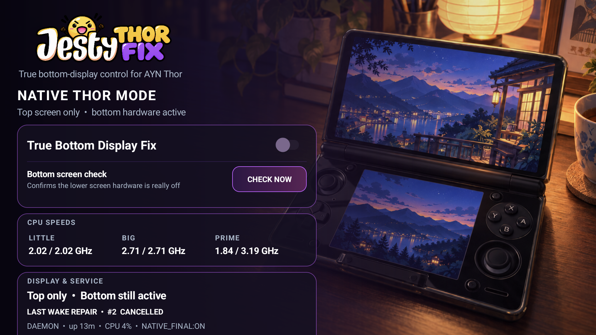
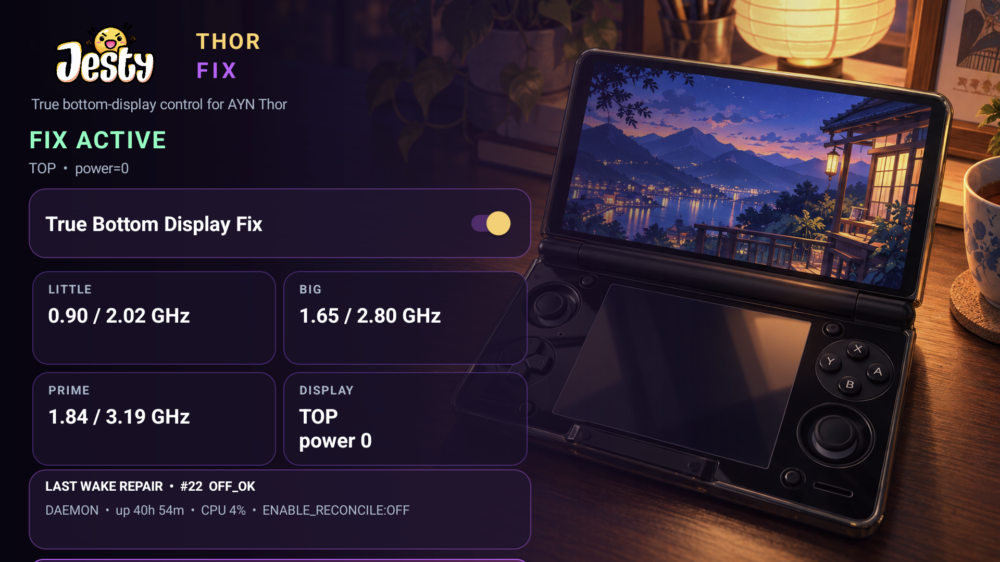

<p align="center">
  
</p>

<p align="center">
  <strong>Actually turns the AYN Thor bottom screen off.</strong><br>
  Fixes the stock TOP-only mode so the lower screen is really powered down, helps stop the CPU from staying unnecessarily fast, and restores the fix automatically after wake.
</p>

<p align="center">
  <strong>No rooting the device. No Magisk. No terminal. No need to keep the app open.</strong><br>
  Install it, enable the fix, and forget about it.
</p>

<p align="center">
  
  
  
  
  
</p>

<p align="center">
  <a href="https://github.com/JestyLabs/Jesty-Thor-Fix/releases/tag/v1.0.0"><strong>Download APK</strong></a>
  · <a href="#what-does-it-fix">How it works</a>
  · <a href="docs/BENCHMARKS.md">Measurements and raw data</a>
  · <a href="https://www.buymeacoffee.com/jesty">☕ Support development</a>
</p>

### See the fix in action

| Stock TOP-only — bottom hardware active, LITTLE/BIG pinned | Jesty true-off — bottom hardware off, clocks released |
| --- | --- |
|  |  |

> [!IMPORTANT]
> **Made specifically for the AYN Thor.** This is an independent community
> project and is not made, supported, or endorsed by AYN Technologies. It uses
> the Thor firmware's own privileged `PServerBinder` service, so you do **not**
> need to root the device yourself or install Magisk. It should not be installed
> on unrelated devices.

## The simple version

The Thor's stock **TOP-only** mode makes the bottom screen look off, but on the
firmware I tested it is not fully shut down in the background.

That matters because the Thor can keep doing unnecessary display work and, in
my low-load tests, the CPU also stayed at unusually high speeds. The result is
extra power use and heat while you are only using the top screen.

**Jesty Thor Fix makes TOP-only behave the way you would expect: the bottom
screen is actually turned off.**

And for normal use, it is designed to be almost completely hands-off:

- **No rooting the device**
- **No Magisk**
- **No terminal commands**
- Install the APK and enable the fix
- You do **not** need to leave the dashboard open
- You can **swipe the app away from Recents**
- The background fix keeps working
- It automatically repairs the state after sleep/wake
- It remembers whether you left the fix enabled after a normal reboot
- Designed for **negligible background CPU and battery overhead**
- It does **not** force CPU frequencies or change CPU governors

Basically:

**install → enable → forget about it**

## What does it fix?

The stock behavior and Jesty Thor Fix differ like this:

| | Stock TOP-only | Jesty Thor Fix |
| --- | --- | --- |
| Bottom screen | Looks off | **Actually off** |
| Background display activity | Still active on tested firmware | **Disabled** |
| CPU behavior in my low-load test | Stayed unusually fast | **High-frequency lock removed** |
| Power use in my test | Higher | **Lower** |
| After waking from sleep | Bottom display becomes active again | **Fix is restored automatically** |
| App needs to stay open | — | **No** |
| Can be removed from Recents | — | **Yes** |
| Magisk / rooting required | — | **No** |

## Why use it?

- **Actually turns the bottom display off** instead of only making it appear black.
- **Helps avoid the high CPU-frequency behavior** I measured in stock TOP-only mode.
- **Reduced unnecessary power use and heat in my testing.**
- **Automatically restores the fix after sleep/wake.**
- **TOP/BOTH switching still works normally.**
- **Does not change CPU governors, limits or frequencies.**
- **Keeps working without the dashboard open.**
- **Keeps working after being swiped away from Recents.**
- **Remembers whether you left the fix enabled after a normal reboot.**
- **Shows live CPU and display information** if you want to verify what the Thor is doing.

## Measured on real hardware

A controlled A/B/A capture compared native TOP mode with Jesty true-off under
the same low-load, USB-powered conditions:

| Metric | Native TOP | Jesty true-off | Result in this capture |
| --- | ---: | ---: | ---: |
| LITTLE average | 2.016 GHz | 1.616 GHz | -19.8% |
| BIG average | 2.707 GHz | 1.654 GHz | -38.9% |
| LITTLE at >=95% maximum | 75/75 samples | 22/45 samples | no longer continuous |
| BIG at >=95% maximum | 75/75 samples | 0/45 samples | lock eliminated |
| System-power proxy | 2.030 W | 1.239 W | **-0.792 W / -39.0%** |
| 1-minute load average | 0.465 | 0.425 | comparable low load |

> [!NOTE]
> The power number is a short-run directional proxy calculated from USB input
> minus battery charging power. It is **not** a promise of 39% more battery
> life. Firmware, brightness, workload, battery state, charger, and temperature
> can change the result. The full method and sanitized CSV samples are in
> [docs/BENCHMARKS.md](docs/BENCHMARKS.md).

For anyone who wants the technical verification, the exact downloadable APK was
installed on the tested Thor. Manual native/fix transitions succeeded, a
sleep/wake repair ended `OFF_OK`, and a one-shot DRM check returned:

```text
top CRTC 181    active
bottom CRTC 243 inactive
```

## Installation

1. Download `Jesty-Thor-Fix-1.0.0.apk` from the
   [GitHub release](https://github.com/JestyLabs/Jesty-Thor-Fix/releases/tag/v1.0.0).
2. Install the APK.
3. Open **Jesty Thor Fix** once and confirm `FIX ACTIVE`.
4. Select TOP mode and use **Bottom screen check -> Check now**. The app should
   report that the bottom screen is fully off. Technical DRM details remain in
   the validation documentation.

### You do not need to

- root the Thor yourself;
- install Magisk;
- run ADB or terminal commands;
- leave the app open;
- leave the app in Recents;
- manually re-enable the fix after every sleep/wake.

Requirements:

- AYN Thor.
- Tested Android 13 firmware `TKQ1.231222.001`, build dated 2026-02-06.
- The Thor firmware's built-in privileged `PServerBinder` command bridge.

Self-built APKs will not update the official build unless they are signed with
the same private key.

## Everyday behavior

Once enabled, the intended normal experience is **install and forget**.

- Closing the dashboard does not normally stop the fix.
- Swiping the app away from Recents does not normally stop the fix.
- The background component continues handling TOP-only state.
- Sleep/wake is repaired automatically.
- A normal reboot restores the saved ON/OFF choice.
- Turning the master toggle OFF cancels pending work and restores native behavior.
- The app respects Android's normal display timeout.
- Background monitoring is deliberately lightweight and designed for negligible overhead.

**Android Settings -> Force stop is different.** Force stop explicitly tells
Android to stop the app and may prevent it from restarting automatically until
you open it again. Swiping it away from Recents is fine; Force stop is not the
same thing.

<details>
<summary><strong>Technical details: how the wake repair works</strong></summary>

Manual TOP/BOTH transitions are handled immediately. During a wake in TOP
mode, Android can reactivate Display 4 as part of its shared display power
pipeline. Trying to switch it off immediately caused collisions and severe
jank in earlier builds.

The current strategy waits 700 ms from wake and never repairs earlier than
400 ms after a late Display 4 ON callback. A generation token cancels stale
work across fast mode or sleep changes. This gives Android time to complete
screen-on before one final true-off operation.

This userland fix guarantees the final state. It cannot stop Android from
briefly rebuilding lower-display topology during wake; eliminating that churn
would require a framework or `system_server` policy change.

The daemon listens only on `127.0.0.1:3804`. See
[docs/ARCHITECTURE.md](docs/ARCHITECTURE.md) for the protocol and architecture.

</details>

<details>
<summary><strong>Building from source</strong></summary>

Required tools: PowerShell 5.1/7, JDK 17, Android SDK platform 34, Android Build
Tools 35.0.0, and apktool 3.0.3 or compatible.

Place `apktool.jar` at `tools/apktool.jar`, or set `APKTOOL_JAR`, then run:

```powershell
.\build.ps1
```

The source contains no keystore, password, token, device log, or
maintainer-specific path. Signing is opt-in and reads the password interactively.

</details>

## Support and contribute

**Jesty Thor Fix is free and open source.**

If the project improves your Thor, there are several ways you can help:

- ⭐ **Star the repository** so other Thor owners can find it.
- 🧪 **Test another firmware version** and share carefully redacted results.
- 🐛 **Report bugs** or unexpected behavior.
- 💡 **Suggest improvements** or contribute code/documentation.
- ☕ **[Buy me a coffee](https://www.buymeacoffee.com/jesty)** to help fund
  hardware testing, firmware compatibility work, documentation, and future updates.

I only have access to my own Thor, so results from other units and firmware
versions are especially useful.

Testing and useful reports are just as valuable as financial support.

<p align="center">
  <a href="https://www.buymeacoffee.com/jesty">
    
  </a>
</p>

Bug reports and carefully redacted device evidence are welcome. Never upload a
keystore, password, device serial, account email, or unreviewed log bundle.

## Documentation

- [Architecture](docs/ARCHITECTURE.md)
- [Hardware validation checklist](docs/DEVICE-VALIDATION.md)
- [Live results](docs/LIVE-RESULTS.md)
- [Benchmarks and raw samples](docs/BENCHMARKS.md)
- [Release integrity](docs/RELEASE-INTEGRITY.md)
- [AI assistance disclosure](AI_DISCLOSURE.md)

## License and credits

- Source code and scripts: [GPL-3.0-only](LICENSE).
- Jesty mascot, wordmark, and application artwork: [ASSETS-LICENSE.md](ASSETS-LICENSE.md).
- External references and trademarks: [THIRD_PARTY_NOTICES.md](THIRD_PARTY_NOTICES.md).

AYN and Thor are trademarks or product names of their respective owner. Their
use here is descriptive only. This project was developed with disclosed
generative-AI assistance under the maintainer's direction.
