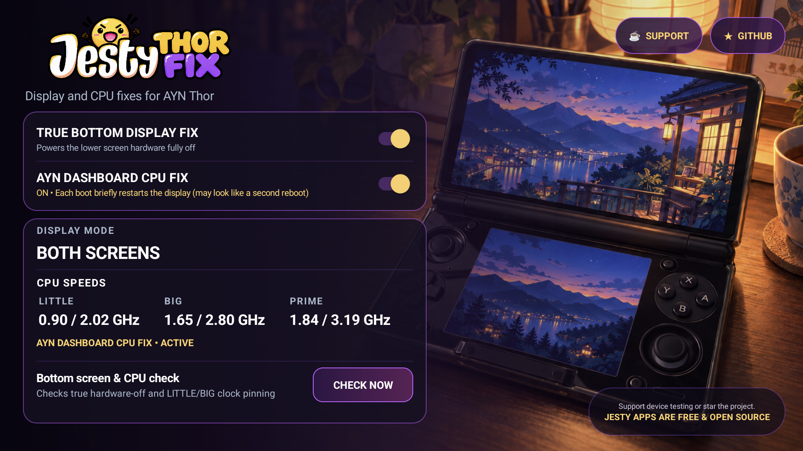
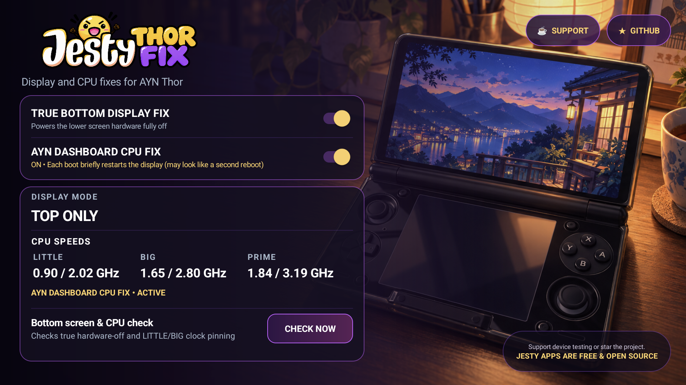

<p align="center">
  
</p>

<p align="center">
  <strong>Fixes two separate AYN Thor firmware problems.</strong><br>
  A lower screen that looks off but is still active, and CPU clocks that can
  stay pinned while using AYN Dashboard.
</p>

<p align="center">
  <strong>No Magisk. No terminal. No need to keep the app open.</strong><br>
  Install it, enable the fixes you need, and forget about it.
</p>

<p align="center">
  <a href="https://github.com/JestyLabs/Jesty-Thor-Fix/releases/tag/v1.1.1"><strong>Download APK</strong></a>
  · <a href="#what-does-it-fix">What it fixes</a>
  · <a href="#possible-battery-benefit">Measurements</a>
  · <a href="https://www.buymeacoffee.com/jesty">☕ Support development</a>
</p>

<p align="center">
  
  
  
  
</p>

## What does it fix?

The app has **two independent switches** because the Thor has two different
problems:

| Problem | What you may notice | Fix to enable |
| --- | --- | --- |
| The lower display is black in TOP mode, but its hardware is still active | The screen looks off, yet the display controller remains on and can return after wake | **True Bottom Display Fix** |
| AYN Dashboard can make LITTLE/BIG CPU clocks stay at maximum | The CPU cannot downclock normally at low load, potentially wasting power and producing extra heat | **AYN Dashboard CPU Fix** |

Use only the fix you need, or enable both. The choices are saved and restored
after a normal reboot.

### Which switches should I use?

| How you use the Thor | Recommended setting |
| --- | --- |
| You use TOP mode and want the lower display truly powered off | Enable **True Bottom Display Fix** |
| You use AYN Dashboard or regularly use both screens | Enable **AYN Dashboard CPU Fix** |
| You switch between TOP and BOTH | Enable **both fixes** |

<p align="center">
  
</p>

## Bug 1: black does not always mean off

When you select **TOP** mode, the expected result is simple: the top screen
stays on and the lower display powers down.

On the tested Thor firmware, the stock mode could make the lower panel look
completely black while its physical display hardware was still active. Looking
at the glass is therefore not enough to tell whether it is really off.

**True Bottom Display Fix** follows the selected display mode:

- in **TOP**, it powers down the lower display hardware;
- after sleep or wake, it checks and restores true-off if Android reactivated it;
- in **BOTH** or **BOTTOM**, it leaves the lower display available normally;
- it does not choose a display mode for you.

| | Stock TOP-only | TOP with Jesty true-off |
| --- | --- | --- |
| What the lower panel looks like | Black | Black |
| Physical lower display hardware | **Still active** on the tested firmware | **Powered off** |
| After sleep/wake | Lower hardware can become active again | True-off is restored automatically |
| App must remain open | — | **No** |

<p align="center">
  
</p>

Tap **Bottom screen & CPU check → Check now** if you want the app to verify
the physical lower-display state. `Bottom hardware fully off` is stronger
evidence than a screen that merely looks black.

## Bug 2: AYN Dashboard can hold CPU clocks at maximum

The Thor CPU has different groups of cores. The app labels them **LITTLE**,
**BIG**, and **PRIME**. “Pinned” means a group remains at or near its maximum
frequency even when the device is under light load.

This second bug is separate from the lower-screen true-off problem. It can
happen while **both screens are intentionally on**.

When LITTLE and BIG stay pinned at maximum, the CPU cannot reduce those clocks
normally during light use. That unnecessary high-frequency state can consume
more power, create more heat, and reduce battery runtime.

We reproduced it with AYN Dashboard genuinely open on the lower display and
the Thor in BOTH mode. Under low load:

- LITTLE remained at **2.02 / 2.02 GHz**;
- BIG remained at **2.71 / 2.71 GHz**;
- the sustained condition was detected in red by Jesty Thor Fix.

<p align="center">
  
</p>

**AYN Dashboard CPU Fix** disables the vendor display system-load check that
caused the reproduced behavior. It does **not** set CPU frequencies, change
governors, or apply a performance profile.

With the fix enabled, a focused BOTH-mode validation recorded **0/25 samples**
where LITTLE and BIG were simultaneously stuck at maximum.

> [!WARNING]
> Changing **AYN Dashboard CPU Fix** restarts the Android framework once and
> closes open apps. The displays stay black for a short period while Android
> returns. When enabled, this restart also happens once during a normal boot,
> which can look like a second boot phase. Version 1.1.1 prevents the Thor from
> suspending during this transition; the timed protection is released after
> Android has recovered.

## Install once, then close the app

1. Download `Jesty-Thor-Fix-1.1.1.apk` from the
   [v1.1.1 release](https://github.com/JestyLabs/Jesty-Thor-Fix/releases/tag/v1.1.1).
2. Install and open **Jesty Thor Fix** once.
3. Enable the switch for each problem you want to fix.
4. Use **Check now** if you want to verify the current display and CPU state.

You do **not** need to root the Thor yourself, install Magisk, use Termux, or
run commands. The app uses the privileged `PServerBinder` bridge already
provided by the Thor firmware.

After setup, you can:

- close the app;
- swipe it away from Recents;
- use another launcher or game;
- switch normally between TOP, BOTH, and BOTTOM;
- reboot normally and keep your saved choices.

The visible app is only a control panel. A small privileged background service
applies the saved fixes and performs lightweight periodic checks; it does not
run a busy loop.

> [!IMPORTANT]
> **Android Settings → Force stop is different from closing the app.** Force
> stop explicitly blocks the background service until you open the app again.
> Swiping the app away from Recents does not.

## Possible battery benefit

Both bugs can waste energy in different ways: Bug 1 can leave unwanted display
hardware active, while Bug 2 can prevent CPU clusters from downclocking
normally. Fixing either behavior may reduce unnecessary power use. Actual
battery life depends on brightness, games, performance mode, temperature,
firmware, and background activity.

Only the **True Bottom Display Fix** has a published power comparison. In one
controlled A/B/A low-load capture, its measured system-power proxy changed
from **2.030 W to 1.239 W**:

| Metric | Native TOP | Jesty true-off | Difference in this capture |
| --- | ---: | ---: | ---: |
| LITTLE average | 2.016 GHz | 1.616 GHz | -19.8% |
| BIG average | 2.707 GHz | 1.654 GHz | -38.9% |
| BIG at ≥95% maximum | 75/75 samples | 0/45 samples | continuous lock removed |
| System-power proxy | 2.030 W | 1.239 W | **-0.792 W / -39.0%** |

This short result does **not** mean 39% more battery life. The proxy is useful
for direction and approximate magnitude, not as a battery-runtime promise.
See the [method and sanitized samples](docs/BENCHMARKS.md).

The separate Dashboard CPU Fix allows LITTLE/BIG to downclock instead of
remaining pinned at maximum, so it can also reduce wasted power. We have not
yet isolated that fix in a controlled wattage or battery-runtime test, so no
percentage is claimed for it.

## Compatibility and coexistence

- Built specifically for the **AYN Thor**.
- Tested on Android 13 firmware `TKQ1.231222.001`, build dated 2026-02-06.
- Requires the Thor firmware's built-in privileged bridge.
- Do not install it on unrelated Android devices.

Jesty Thor Fix does not write CPU governors, clock limits, or tuning profiles.
It is designed not to take ownership of Pulse or Cluster Tune settings, but a
specific combination should only be called confirmed after that exact setup is
tested on-device.

<details>
<summary><strong>What was verified on the physical Thor?</strong></summary>

The exact signed v1.1.1 APK was installed in place and tested:

- package `com.thor.displaypowertest`, version code `43`, version `1.1.1`;
- signing certificate unchanged from earlier releases;
- TOP true-off ended with the top CRTC active and the lower CRTC inactive;
- sleep/wake restored true-off and ended `OFF_OK`;
- BOTH kept both displays active;
- the Dashboard fix changed the reproduced result to 0/25 simultaneous
  LITTLE/BIG maximum samples in the focused run;
- both CPU-fix ON and OFF completed one Android framework restart without the
  device suspending behind the black screens;
- the privileged service recovered after each framework restart;
- a real reboot restored both saved fixes;
- closing the visible app left the fixes active.

APK SHA-256:

```text
C72019B4AD1C3AB0717AC5B963C206960754EDDC362D55D491EACAE8DA04B82F
```

</details>

<details>
<summary><strong>Technical true-off details</strong></summary>

The tested Thor exposes the top and lower displays through DRM CRTCs 181 and
243. Confirmed TOP true-off is `crtc181=1` and `crtc243=0`. During wake,
Android can reactivate the lower display through its shared display-power
pipeline, so the service waits for wake to settle and then performs one final
true-off operation. A generation token cancels stale work during rapid mode or
sleep changes. See [Architecture](docs/ARCHITECTURE.md).

</details>

<details>
<summary><strong>Build from source</strong></summary>

Required tools: PowerShell 5.1/7, JDK 17, Android SDK platform 34, Android Build
Tools 35.0.0, and apktool 3.0.3 or compatible.

Place `apktool.jar` at `tools/apktool.jar`, or set `APKTOOL_JAR`, then run:

```powershell
.\build.ps1
```

The repository contains no signing key or password. Self-built APKs will not
update the official build unless signed with the same private key.

</details>

## Support and documentation

Jesty Thor Fix is free and open source. No feature is locked behind donations.

- ⭐ Star the repository so other Thor owners can find it.
- 🧪 Share carefully redacted results from another firmware version.
- 🐛 Report bugs or compatibility issues.
- ☕ [Buy me a coffee](https://www.buymeacoffee.com/jesty) to support device
  testing, documentation, and future updates.

Documentation: [architecture](docs/ARCHITECTURE.md) ·
[device validation](docs/DEVICE-VALIDATION.md) ·
[live results](docs/LIVE-RESULTS.md) ·
[benchmarks](docs/BENCHMARKS.md) ·
[release integrity](docs/RELEASE-INTEGRITY.md)

## License, provenance, and independence

- Source code and scripts: [GPL-3.0-only](LICENSE).
- Jesty branding and application artwork: [ASSETS-LICENSE.md](ASSETS-LICENSE.md).
- External references and trademarks: [THIRD_PARTY_NOTICES.md](THIRD_PARTY_NOTICES.md).
- Generative-AI assistance to code, investigation, documentation, and visual
  work: [full disclosure](AI_DISCLOSURE.md).

AYN and Thor are trademarks or product names of their respective owner. This is
an independent community project and is not affiliated with or endorsed by AYN
Technologies. AI-assisted work was directed, supervised, reviewed, and tested
by the maintainer; runtime claims above come from physical-device evidence.
